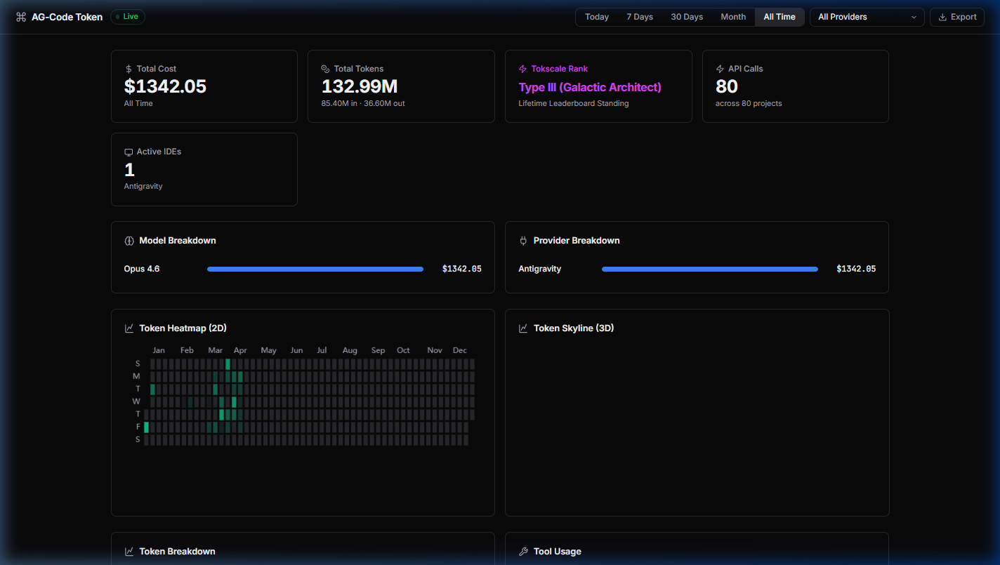

<p align="center">
  
</p>

<h1 align="center">AG-Code Token</h1>

<p align="center">
  <strong>Universal AI token usage monitor for every coding IDE and agent.</strong>
</p>

<p align="center">
  Track costs across Claude Code, Codex, Cursor, Windsurf, Cline, Copilot, Antigravity, Gemini CLI, Roo Code, and 13 more
  — from a single dashboard. Zero dependencies. Fully local.
</p>

<p align="center">
  <a href="#quick-start"></a>
  <a href="#supported-tools"></a>
  <a href="#supported-models"></a>
  <a href="LICENSE"></a>
</p>

<p align="center">
  <a href="#quick-start">Quick Start</a> &middot;
  <a href="#features">Features</a> &middot;
  <a href="#supported-tools">Supported Tools</a> &middot;
  <a href="#architecture">Architecture</a> &middot;
  <a href="#api-reference">API</a> &middot;
  <a href="#contributing">Contributing</a>
</p>

---

## The Problem

You use AI coding tools daily — Claude Code, Codex, Cursor, perhaps Copilot. Each burns through tokens at different rates with different pricing. But there is **no unified view** of where your money goes.

**AG-Code Token** reads the session files your tools already write to disk, normalizes them into a common format, and renders a real-time dashboard. No API keys. No external services. No data leaves your machine.

---

## Quick Start

```bash
git clone https://github.com/vuckuola619/ag-code-token.git
cd ag-code-token
node server.js
```

Open [http://localhost:3777](http://localhost:3777) in your browser. The server auto-discovers installed AI tools and begins parsing session data immediately.

> **Requirements:** Node.js 18+ (ES modules, native `fetch`). No `npm install` required — the entire project runs on Node.js built-in modules only.

---

## Features

### Cross-IDE Observability
Monitor token consumption across **22 AI coding tools** from a single interface. Identify which tool, model, or project is driving your costs.

### Real-Time Cost Calculation
Automatic pricing using live data from [LiteLLM](https://github.com/BerriAI/litellm) (cached 24h) with hardcoded fallbacks covering 50+ models. Supports input, output, cache read, cache write, reasoning, and web search token categories.

### Token Heatmap
GitHub-style contribution heatmap visualizing your daily token consumption patterns across the full calendar year.

### Plugin Architecture
Every AI tool is a self-contained provider plugin. Each file in `providers/` implements a standard interface for session discovery, parsing, and normalization. Adding support for a new tool means adding a single file.

### Cost Advisor
Analyze usage patterns and receive actionable optimization recommendations:
- **[RTK](https://github.com/rtk-ai/rtk) integration** — token reduction proxy (60-90% savings)
- **Prompt caching detection** — flags sessions with 0% cache utilization
- **[LLM-Wiki](https://gist.github.com/karpathy/442a6bf555914893e9891c11519de94f)** — Karpathy's persistent context strategy
- **Model tiering** — detects premium model usage where cheaper alternatives apply
- **Context window alerts** — warns about oversized prompts
- **Config recommendations** — `.cursorrules`, `.clinerules`, `.gitignore` tuning

### Dashboard Panels
- **Hero Stats** — total cost, token count, API calls, active IDEs, Tokscale rank
- **Model Breakdown** — cost and usage per LLM (Opus 4.6, GPT-5, Gemini Pro, etc.)
- **Provider Breakdown** — side-by-side comparison across all tools
- **Token Breakdown** — input, output, cache read, cache write, reasoning tokens
- **Tool Usage** — agent tool call frequency (Read, Edit, Bash, WebFetch, Search)
- **Project Table** — per-project cost, token count, and provider badges

### Export
Download usage data as CSV or JSON via the dashboard or API:
```bash
curl http://localhost:3777/api/export?period=week&format=csv
curl http://localhost:3777/api/export?period=month&format=json
```

### Privacy
All data stays on your machine. The only external request is fetching model pricing from a public GitHub JSON file. No telemetry, no tracking, no API keys required. See [SECURITY.md](SECURITY.md) for the full threat model.

### Zero Dependencies
No `npm install`. No `node_modules`. The server uses only Node.js built-in modules (`http`, `fs`, `path`, `os`, `crypto`). The dashboard is a single HTML file with inline CSS and JS.

### CLI Interface
Terminal-based usage summary with Tokscale rank calculation:
```bash
npx ag-token          # View usage summary
npx ag-token submit   # Generate leaderboard profile
```

---

## Supported Tools

### Core Providers (Full Parsing)

| Tool | Data Source | Session Format |
|------|------------|----------------|
| **[Antigravity](https://deepmind.google/)** (Google DeepMind) | `~/.gemini/antigravity/` | Protobuf + brain steps |
| **[Claude Code](https://docs.anthropic.com/en/docs/claude-code)** (Anthropic) | `~/.claude/projects/` | JSONL transcripts |
| **[Codex](https://openai.com/codex)** (OpenAI) | `~/.codex/sessions/` | JSONL rollouts |
| **[Cursor](https://cursor.sh/)** | `~/.config/Cursor/` | JSON/JSONL logs |
| **[Windsurf](https://codeium.com/windsurf)** (Codeium) | `~/.config/Windsurf/` | JSON/JSONL logs |
| **[Cline](https://github.com/cline/cline)** | VS Code `globalStorage` | JSON history |
| **[GitHub Copilot](https://github.com/features/copilot)** | VS Code `globalStorage` | JSON/JSONL |
| **[Continue.dev](https://continue.dev/)** | `~/.continue/sessions/` | JSON sessions |
| **[Aider](https://aider.chat/)** | `~/.aider/` | JSONL analytics |

### Extended Providers (Heuristic Parsing)

| Tool | Data Source |
|------|------------|
| **[OpenCode](https://github.com/opencode-ai/opencode)** | SQLite database |
| **[Gemini CLI](https://github.com/google-gemini/gemini-cli)** | `~/.gemini/tmp/` |
| **[AmpCode](https://ampcode.com/)** | `~/.local/share/amp/` |
| **[Roo Code](https://roocode.com/)** | VS Code `globalStorage` |
| **[Kilo Code](https://kilocode.ai/)** | VS Code `globalStorage` |
| **[Factory Droid](https://factory.ai/)** | `~/.factory/sessions/` |
| **[Pi Agent](https://github.com/pi-agi)** | `~/.pi/agent/sessions/` |
| **[Kimi CLI](https://kimi.ai/)** | `~/.kimi/sessions/` |
| **[Qwen CLI](https://qwen.ai/)** | `~/.qwen/projects/` |
| **Hermes Agent** | `~/.hermes/state.db` |
| **Synthetic / Octofriend** | SQLite database |
| **Mux** | `~/.mux/sessions/` |
| **Crush AI** | `~/.local/share/crush/` |

All providers support **Windows**, **macOS**, and **Linux** path conventions.

---

## Supported Models

Pricing data for **50+ models** across 10 providers, refreshed automatically from LiteLLM:

| Provider | Models |
|----------|--------|
| **Anthropic** | Opus 4.6, Opus 4.5, Opus 4.1, Sonnet 4.6, Sonnet 4.5, Sonnet 4, Sonnet 3.7, Sonnet 3.5, Haiku 4.5, Haiku 3.5 |
| **OpenAI** | GPT-5.4, GPT-5, GPT-4.1, GPT-4o, o4-mini, o3, o1 |
| **Google** | Gemini 2.5 Pro, Gemini 2.5 Flash, Gemini 2.0 Flash, Gemini 1.5 Pro |
| **DeepSeek** | V3, R1, Coder |
| **Mistral** | Large, Medium, Small, Codestral |
| **Meta** | Llama 4 Maverick, Llama 4 Scout, Llama 3.3 70B, Llama 3.1 405B |
| **Qwen** | 2.5 Coder 32B, 2.5 72B, Max |
| **Cohere** | Command R+, Command R |
| **xAI** | Grok 3, Grok 3 Mini, Grok 2 |
| **Local** | Ollama, LM Studio, vLLM (free tier) |

---

## Architecture

```
ag-code-token/
├── server.js                # HTTP server (Node.js built-ins only)
├── models.js                # LLM pricing engine (LiteLLM + 56 hardcoded fallbacks)
├── parser.js                # Discovery → parse → deduplicate → aggregate pipeline
├── security.js              # Rate limiting, CSP, input validation, audit logging
├── watcher.js               # Real-time filesystem watchers (SSE push)
├── sql_scanner.js           # Zero-dependency SQLite heuristic scanner
├── cli.js                   # Terminal interface and profile generator
├── providers/
│   ├── index.js             # Provider registry and discovery
│   ├── types.js             # JSDoc interface definitions
│   ├── antigravity.js       # Google DeepMind Antigravity
│   ├── claude.js            # Anthropic Claude Code
│   ├── codex.js             # OpenAI Codex CLI
│   ├── cursor.js            # Cursor IDE
│   ├── windsurf.js          # Windsurf (Codeium)
│   ├── cline.js             # Cline VS Code extension
│   ├── copilot.js           # GitHub Copilot
│   ├── continuedev.js       # Continue.dev
│   ├── aider.js             # Aider CLI
│   ├── extended.js          # 10 additional JSON/JSONL providers
│   └── sqlite_providers.js  # SQLite-backed providers (OpenCode, Hermes)
├── public/
│   └── index.html           # Single-file dashboard (HTML + CSS + JS)
└── package.json
```

### Data Flow

```
 Session files on disk (JSONL, JSON, Protobuf, SQLite)
                │
                ▼
┌──────────────────────────┐
│  Provider Plugins (22)   │  Each plugin knows where to find its tool's
│  providers/*.js          │  data and how to parse it
└───────────┬──────────────┘
            │
            ▼
┌──────────────────────────┐
│  Parser Pipeline         │  Deduplication, date filtering, token
│  parser.js               │  normalization across provider semantics
└───────────┬──────────────┘
            │
            ▼
┌──────────────────────────┐
│  Pricing Engine          │  LiteLLM live pricing + hardcoded fallbacks
│  models.js               │  Covers cache, reasoning, and search tokens
└───────────┬──────────────┘
            │
            ▼
┌──────────────────────────┐
│  HTTP API + Dashboard    │  JSON endpoints, SSE streaming, static UI
│  server.js               │  Rate limiting, CSP, security headers
└──────────────────────────┘
```

---

## API Reference

All endpoints return JSON. CORS is enabled by default.

| Endpoint | Description |
|----------|-------------|
| `GET /api/health` | Server status, version, timestamp |
| `GET /api/providers` | Registered and active providers with session counts |
| `GET /api/summary?period=week&provider=all` | Aggregate stats for a period (`today`, `week`, `30days`, `month`, `all`) |
| `GET /api/projects?period=week&provider=all` | Per-project breakdown with model and tool details |
| `GET /api/multi-period` | Summary across all periods in a single call |
| `GET /api/export?period=week&format=csv` | Export as CSV or JSON |
| `GET /api/tips` | Token-saving recommendations based on current usage |
| `GET /api/events` | Server-Sent Events stream for real-time updates |

### Example Response

```json
{
  "period": "All Time",
  "totalCostUSD": 1342.05,
  "totalInputTokens": 85400000,
  "totalOutputTokens": 36600000,
  "totalApiCalls": 80,
  "projectCount": 80,
  "models": [{ "name": "Opus 4.6", "calls": 75, "costUSD": 1342.05 }],
  "providers": [{ "name": "antigravity", "displayName": "Antigravity", "costUSD": 1342.05 }]
}
```

---

## Adding a New Provider

1. Create `providers/yourprovider.js`
2. Implement the standard interface:

```javascript
export const yourprovider = {
  name: 'yourprovider',
  displayName: 'Your Provider',
  
  modelDisplayName(model) { return model; },
  toolDisplayName(rawTool) { return rawTool; },
  
  async discoverSessions() {
    return [{ path: '/path/to/sessions', project: 'my-project', provider: 'yourprovider' }];
  },
  
  createSessionParser(source, seenKeys) {
    return {
      async *parse() {
        yield {
          provider: 'yourprovider',
          model: 'gpt-4o',
          inputTokens: 1000,
          outputTokens: 500,
          costUSD: 0.0075,
          tools: ['edit', 'read'],
          timestamp: new Date().toISOString(),
        };
      },
    };
  },
};
```

3. Register in `providers/index.js`

See [CONTRIBUTING.md](CONTRIBUTING.md) for complete guidelines.

---

## Configuration

| Variable | Default | Description |
|----------|---------|-------------|
| `PORT` | `3777` | HTTP server port |
| `CLAUDE_CONFIG_DIR` | `~/.claude` | Claude Code configuration directory |
| `CODEX_HOME` | `~/.codex` | Codex CLI home directory |
| `ANTIGRAVITY_DIR` | `~/.gemini/antigravity` | Antigravity data directory |

```bash
PORT=8080 node server.js
```

---

## FAQ

<details>
<summary><strong>Do I need to run npm install?</strong></summary>

No. AG-Code Token uses only Node.js built-in modules. Run `node server.js` directly.
</details>

<details>
<summary><strong>Does it transmit any data externally?</strong></summary>

No. The only outgoing request fetches model pricing from LiteLLM's public GitHub repository (a static JSON file), cached for 24 hours. If the request fails, hardcoded pricing is used. No telemetry, no analytics.
</details>

<details>
<summary><strong>How does it discover my AI tool sessions?</strong></summary>

Each provider plugin knows the default filesystem paths where its tool stores session data. The server scans those directories on startup and watches them for changes via `fs.watch()`, pushing updates over Server-Sent Events.
</details>

<details>
<summary><strong>Can I run it as a background service?</strong></summary>

Yes. Use any process manager:
```bash
npx pm2 start server.js --name ag-code-token
```
</details>

<details>
<summary><strong>How accurate are the cost calculations?</strong></summary>

For tools that log per-token usage natively (Claude Code, Codex, Cline, Antigravity), costs are calculated using exact token counts against current model pricing. For tools with less granular data, documented estimation heuristics are applied.
</details>

---

## Roadmap

- [x] CSV and JSON data export
- [x] Token saving advisor (RTK, LLM-Wiki, model tiering)
- [x] GitHub-style token heatmap
- [x] Real-time SSE streaming with filesystem watchers
- [x] Security hardening (rate limiting, CSP, audit logging)
- [x] Extended provider support (22 tools)
- [ ] Historical cost trend charts (daily/weekly)
- [ ] Budget alerts and threshold notifications
- [ ] npm package for programmatic usage
- [ ] Docker image
- [ ] System tray application (Electron/Tauri)
- [ ] Webhook integrations (Slack, Discord)
- [ ] Multi-currency support

---

## Security

See [SECURITY.md](SECURITY.md) for the complete security model, including:
- Data privacy controls (GDPR Art 5, 25, 32)
- Network egress allowlisting
- Rate limiting and CSP headers
- Input validation and path traversal protection
- Vulnerability reporting procedures

---

## Contributing

Contributions are welcome. See [CONTRIBUTING.md](CONTRIBUTING.md) for guidelines.

The highest-impact contribution is **adding a new provider**. If you use an AI coding tool that is not yet supported, open a pull request.

---

## License

[MIT](LICENSE)

---

<p align="center">
  <sub>Built by <a href="https://github.com/vuckuola619">vuckuola619</a></sub>
</p>
